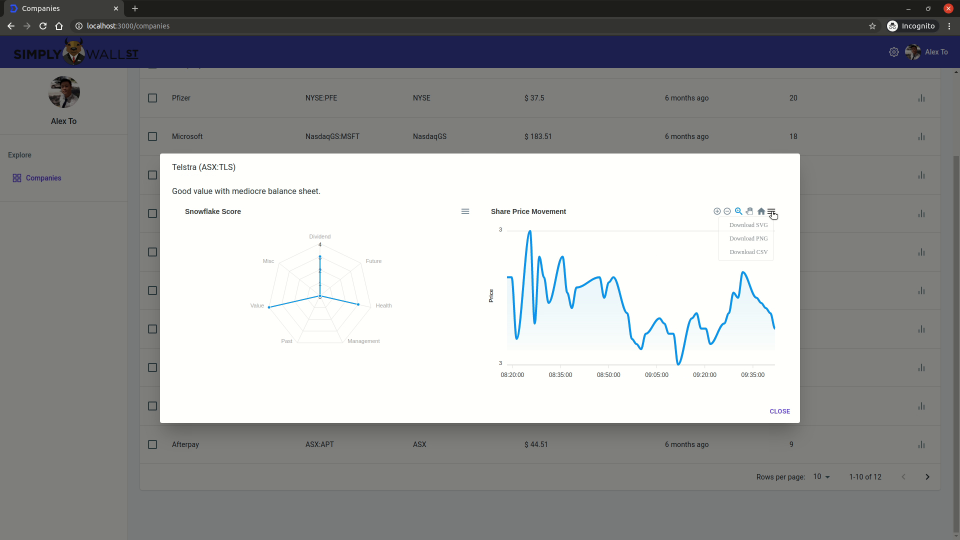
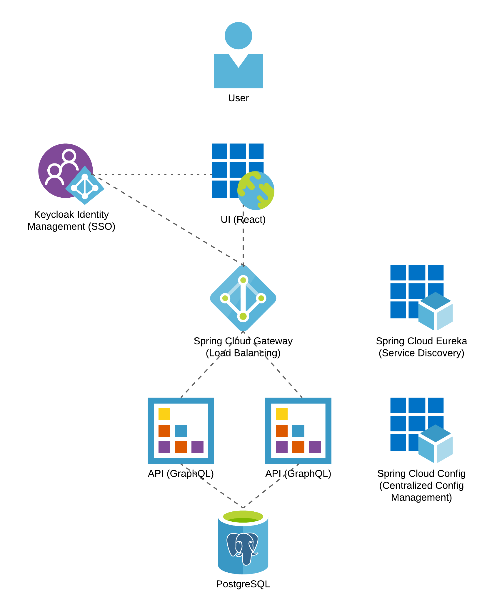

## Installation

The easiest way is to install via Docker

```
$ git clone https://github.com/AlexTo/simplywall.git
$ cd simplywall/docker/demo
$ docker-compose up
```

Grab your coffee, the process may take a couple of minutes to download and start up ;). 

Once done, open your browser and navigate to `http://localhost:3000/`

Login with `username: alexto` and `password: password`. Enjoy! ;) 

A video of the app in action is hosted on Youtube [https://youtu.be/eF4h0ku1XTQ](https://youtu.be/eF4h0ku1XTQ)

[](https://youtu.be/eF4h0ku1XTQ)

## Architecture

The system is designed with micro-services architecture. The key components are as follows:

##### 1. Spring Cloud Eureka

Eureka Server holds the information about all service applications. Every Micro service will register into the Eureka server and Eureka server knows all the client applications running on each port and IP address. Service discovery allows services to find and communicate with each other without hard-coding hostname and port. 

##### 2. Spring Cloud Config

Spring Cloud Config provides server-side and client-side support for externalized configuration in a distributed system. With the Config Server, you have a central place to manage external properties for applications across all environments. 

##### 3. Spring Cloud Gateway 

Spring Cloud Gateway aims to provide a simple, yet effective way to route to APIs and provide cross cutting concerns to them such as: security, monitoring/metrics, and resiliency.

##### 4. Keycloak 

Keycloak is an open source software product to allow single sign-on with Identity and Access Management aimed at modern applications and services. Keycloak allows authentication and authorization with JWT token and seamless integration with external providers such as Active Directory, OpenId, Facebook, Google etc...

##### 5. GraphQL API Micro Services

The API supports GraphQL for minimal bandwidth consumption. The clients only need to request for necessary data and that could make a huge different in the context of mobile applications with low bandwidth.  

##### 6. Frontend

Developed in React, a popular modern front-end framework ;)

